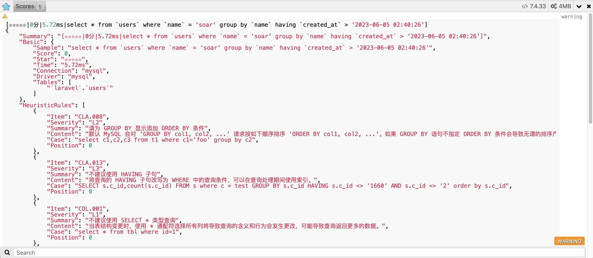

# laravel-soar

> SQL optimizer and rewriter for laravel. - laravel 的 SQL 优化器和重写器。

[](https://github.com/guanguans/laravel-soar/actions)
[](https://github.com/guanguans/laravel-soar/actions)
[](https://codecov.io/gh/guanguans/laravel-soar)
[](//packagist.org/packages/guanguans/laravel-soar)
[](//packagist.org/packages/guanguans/laravel-soar)
[](//packagist.org/packages/guanguans/laravel-soar)

## Feature

* Support sentence optimization based on heuristic algorithm
* Support multi-column index optimization for complex queries (UPDATE, INSERT, DELETE, SELECT)
* Support EXPLAIN informative interpretation
* Support SQL fingerprint, compression and beautification
* Support multiple ALTER request merging of the same table
* Support SQL rewriting of custom rules
* Support Eloquent query builder method to generate SQL optimization report

## Related Links

* [https://github.com/XiaoMi/soar](https://github.com/XiaoMi/soar)
* [https://github.com/guanguans/soar-php](https://github.com/guanguans/soar-php)
* [https://github.com/huangdijia/laravel-web-soar](https://github.com/huangdijia/laravel-web-soar)
* [https://github.com/wilbur-yu/hyperf-soar](https://github.com/wilbur-yu/hyperf-soar)
* [https://github.com/guanguans/think-soar](https://github.com/guanguans/think-soar)

## Requirement

* laravel >= 5.5

## Installation

```shell
$ composer require guanguans/laravel-soar --dev -vvv
```

## Configuration

### Register service

#### laravel

```bash
$ php artisan vendor:publish --provider="Guanguans\\LaravelSoar\\SoarServiceProvider"
```

#### lumen

Add the following snippet to the `bootstrap/app.php` file under the `Register Service Providers` section as follows:

```php
$app->register(\Guanguans\LaravelSoar\SoarServiceProvider::class);
```

## Usage

### Monitor output SQL score


### Interface method

```php
$soar = app('soar'); // 获取 Soar 实例

/**
 * Soar 门面.
 *
 * @method static string score(string $sql)            // SQL 评分
 * @method static array arrayScore(string $sql)        // SQL 数组格式评分
 * @method static string jsonScore(string $sql)        // SQL json 格式评分
 * @method static string htmlScore(string $sql)        // SQL html 格式评分
 * @method static string mdScore(string $sql)          // SQL markdown 格式评分
 * @method static string explain(string $sql)          // explain 解读信息
 * @method static string mdExplain(string $sql)        // markdown 格式 explain 解读信息
 * @method static string htmlExplain(string $sql)      // html 格式 explain 解读信息
 * @method static null|string syntaxCheck(string $sql) // 语法检查
 * @method static string fingerPrint(string $sql)      // SQL 指纹
 * @method static string pretty(string $sql)           // 格式化 SQL
 * @method static string md2html(string $sql)          // markdown 转 html
 * @method static string help()                        // Soar 帮助
 * @method static null|string exec(string $command)    // 执行任意 Soar 命令
 * @method static string getSoarPath()                 // 获取 Soar 路径
 * @method static array getOptions()                   // 获取 Soar 配置选项
 * @method static Soar setSoarPath(string $soarPath)   // 设置 Soar 路径
 * @method static Soar setOption(string $key, $value)  // 设置 Soar 配置选项
 * @method static Soar setOptions(array $options)      // 批量设置 Soar 配置选项
 *
 * @see \Guanguans\SoarPHP\Soar
 */
class Soar{}
```

## Testing

```bash
$ composer test
```

## Changelog

Please see [CHANGELOG](CHANGELOG.md) for more information on what has changed recently.

## Contributing

Please see [CONTRIBUTING](.github/CONTRIBUTING.md) for details.

## Security Vulnerabilities

Please review [our security policy](../../security/policy) on how to report security vulnerabilities.

## Credits

* [guanguans](https://github.com/guanguans)
* [All Contributors](../../contributors)

## License

The MIT License (MIT). Please see [License File](LICENSE) for more information.
