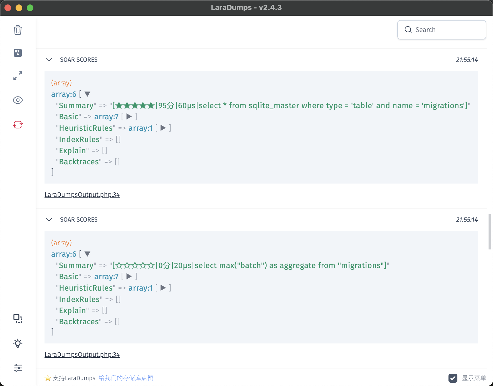
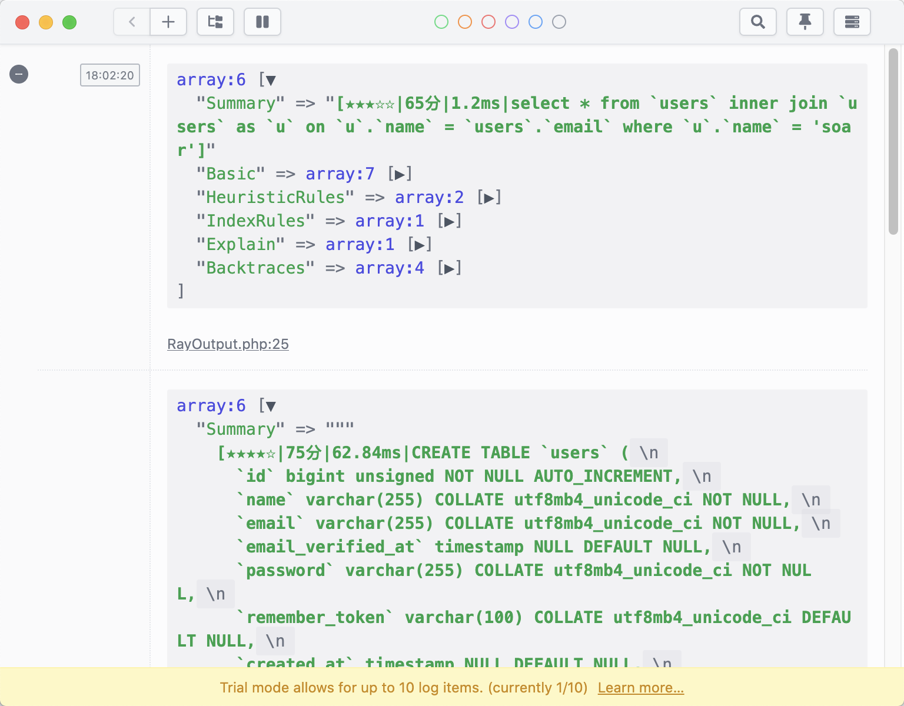
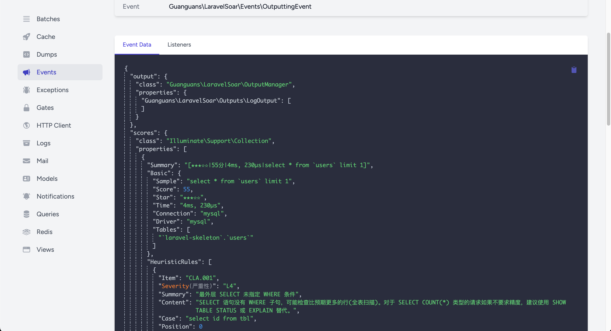
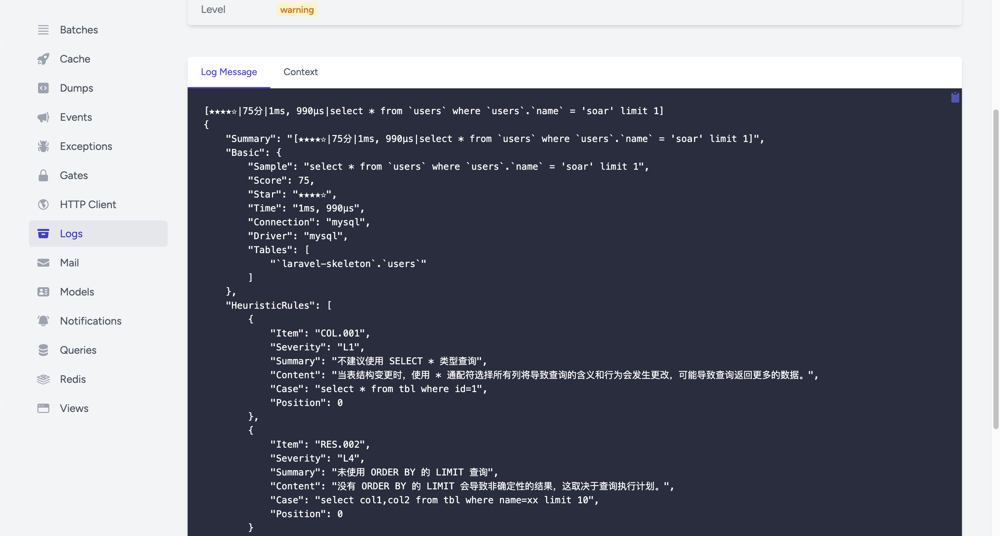

|  |  |
|------------------------|------------------------|

# laravel-soar

> SQL optimizer and rewriter for laravel. - laravel 的 SQL 优化器和重写器。

[简体中文](README-zh_CN.md) | [ENGLISH](README.md)

[](https://github.com/guanguans/laravel-soar/actions/workflows/tests.yml)
[](https://github.com/guanguans/laravel-soar/actions/workflows/php-cs-fixer.yml)
[](https://codecov.io/gh/guanguans/laravel-soar)
[](https://packagist.org/packages/guanguans/laravel-soar)
[](https://github.com/guanguans/laravel-soar/releases)
[](https://packagist.org/packages/guanguans/laravel-soar)
[](https://packagist.org/packages/guanguans/laravel-soar)

## Feature

* Supports heuristic rule suggestions, index rule suggestions, and `EXPLAIN` information interpretation
* Support calling query builder `Mixin` methods for convenient dumping of rule suggestions
* Automatically monitor output rule suggestions to configured outputs

## Related Links

* [https://github.com/XiaoMi/soar](https://github.com/XiaoMi/soar)
* [https://github.com/guanguans/soar-php](https://github.com/guanguans/soar-php)

## Requirement

* PHP >= 8.0

## Installation

```shell
composer require guanguans/laravel-soar --dev --ansi -v
```

## Configuration

### Publish files(optional)

```shell
php artisan vendor:publish --provider="Guanguans\\LaravelSoar\\SoarServiceProvider"
```

### :warning: When running in a unix OS non-cli environment, may throw Fatal error: ...Exit Code: 2(Misuse of shell builtins)

```shell
# Fatal error: Uncaught Guanguans\SoarPHP\Exceptions\ProcessFailedException: The command "'/Users/yaozm/Documents/develop/soar-php/bin/soar.darwin-amd64' '-report-type=json' '-query=select * from users;'" failed. Exit Code: 2(Misuse of shell builtins) Working directory: /Users/yaozm/Documents/develop/soar-php Output: ================ Error Output: ================ panic: runtime error: invalid memory address or nil pointer dereference [signal SIGSEGV: segmentation violation code=0x1 addr=0x0 pc=0x1938665] goroutine 1 [running]: github.com/pingcap/tidb/util/memory.MemTotalNormal() pkg/mod/github.com/pingcap/tidb@v1.1.0-beta.0.20210601085537-5d7c852770eb/util/memory/meminfo.go:41 +0x65 github.com/pingcap/tidb/util/memory.init.0() pkg/mod/github.com/pingcap/tidb@v1.1.0-beta.0.20210601085537-5d7c852770eb/util/memory/meminfo.go:134 +0x175 in /Users/yaozm/Documents/develop/soar-php/src/Concerns/WithRunable.php:36 Stack trace: #0 /Users/yaozm/Documents/develop/soar-php/test.php(163): Guanguans\SoarPHP\Soar->run() #1 /User in /Users/yaozm/Documents/develop/soar-php/src/Concerns/WithRunable.php on line 36
SOAR_SUDO_PASSWORD='your sudo password' # Set a sudo password to run the soar command with sudo to avoid the above errors.
```

## Usage

### Install and configure outputs(optional)

<details>
<summary><b>Clockwork</b></summary>

1. Install [itsgoingd/clockwork](https://github.com/itsgoingd/clockwork)
2. Configure [soar.outputs.Guanguans\LaravelSoar\Outputs\ClockworkOutput::class](config/soar.php)


</details>

<details>
<summary><b>Console</b></summary>

1. Configure [soar.outputs.Guanguans\LaravelSoar\Outputs\ConsoleOutput::class](config/soar.php)


</details>

<details>
<summary><b>DebugBar</b></summary>

1. Install [barryvdh/laravel-debugbar](https://github.com/barryvdh/laravel-debugbar)
2. Configure [soar.outputs.Guanguans\LaravelSoar\Outputs\DebugBarOutput::class](config/soar.php)


</details>

<details>
<summary><b>Dump</b></summary>

1. Configure [soar.outputs.Guanguans\LaravelSoar\Outputs\DumpOutput::class](config/soar.php)


</details>

<details>
<summary><b>Json</b></summary>

1. Configure [soar.outputs.Guanguans\LaravelSoar\Outputs\JsonOutput::class](config/soar.php)

```json
{
    "message": "ok",
    "soar_scores": [
        {
            "Summary": "[☆☆☆☆☆|0分|9.17ms|select * from `users` where `name` = 'soar' group by `name` having `created_at` > '2023-06-05 03:19:30']",
            "Basic": {
                "Sample": "select * from `users` where `name` = 'soar' group by `name` having `created_at` > '2023-06-05 03:19:30'",
                "Score": 0,
                "Star": "☆☆☆☆☆",
                "Time": "9.17ms",
                "Connection": "mysql",
                "Driver": "mysql",
                "Tables": [
                    "`laravel`.`users`"
                ]
            },
            "HeuristicRules": [
                {
                    "Item": "CLA.008",
                    "Severity": "L2",
                    "Summary": "请为 GROUP BY 显示添加 ORDER BY 条件",
                    "Content": "默认 MySQL 会对 'GROUP BY col1, col2, ...' 请求按如下顺序排序 'ORDER BY col1, col2, ...'。如果 GROUP BY 语句不指定 ORDER BY 条件会导致无谓的排序产生，如果不需要排序建议添加 'ORDER BY NULL'。",
                    "Case": "select c1,c2,c3 from t1 where c1='foo' group by c2",
                    "Position": 0
                },
                {
                    "Item": "CLA.013",
                    "Severity": "L3",
                    "Summary": "不建议使用 HAVING 子句",
                    "Content": "将查询的 HAVING 子句改写为 WHERE 中的查询条件，可以在查询处理期间使用索引。",
                    "Case": "SELECT s.c_id,count(s.c_id) FROM s where c = test GROUP BY s.c_id HAVING s.c_id <> '1660' AND s.c_id <> '2' order by s.c_id",
                    "Position": 0
                },
                {
                    "Item": "COL.001",
                    "Severity": "L1",
                    "Summary": "不建议使用 SELECT * 类型查询",
                    "Content": "当表结构变更时，使用 * 通配符选择所有列将导致查询的含义和行为会发生更改，可能导致查询返回更多的数据。",
                    "Case": "select * from tbl where id=1",
                    "Position": 0
                },
                {
                    "Item": "ERR.002",
                    "Severity": "L8",
                    "Summary": "MySQL execute failed",
                    "Content": "Expression #1 of SELECT list is not in GROUP BY clause and contains nonaggregated column 'optimizer_230605111934_bbpxve0adj2dgrcs.users.id' which is not functionally dependent on columns in GROUP BY clause; this is incompatible with sql_mode=only_full_group_by",
                    "Case": "",
                    "Position": 0
                },
                {
                    "Item": "GRP.001",
                    "Severity": "L2",
                    "Summary": "不建议对等值查询列使用 GROUP BY",
                    "Content": "GROUP BY 中的列在前面的 WHERE 条件中使用了等值查询，对这样的列进行 GROUP BY 意义不大。",
                    "Case": "select film_id, title from film where release_year='2006' group by release_year",
                    "Position": 0
                },
                {
                    "Item": "RES.001",
                    "Severity": "L4",
                    "Summary": "非确定性的 GROUP BY",
                    "Content": "SQL返回的列既不在聚合函数中也不是 GROUP BY 表达式的列中，因此这些值的结果将是非确定性的。如：select a, b, c from tbl where foo=\"bar\" group by a，该 SQL 返回的结果就是不确定的。",
                    "Case": "select c1,c2,c3 from t1 where c2='foo' group by c2",
                    "Position": 0
                }
            ],
            "IndexRules": [
                {
                    "Item": "IDX.001",
                    "Severity": "L2",
                    "Summary": "为laravel库的users表添加索引",
                    "Content": "为列name添加索引;为列created_at添加索引; 由于未开启数据采样，各列在索引中的顺序需要自行调整。",
                    "Case": "ALTER TABLE `laravel`.`users` add index `idx_name_created_at` (`name`(191),`created_at`) ;\n",
                    "Position": 0
                }
            ],
            "Explain": [],
            "Backtraces": [
                "#13 /routes/web.php:53",
                "#38 /Users/yaozm/Documents/develop/laravel-soar/src/Http/Middleware/OutputSoarScoreMiddleware.php:37",
                "#59 /public/index.php:55",
                "#60 /server.php:21"
            ]
        },
        {
            "Summary": "[★★★★☆|75分|205.25ms|CREATE TABLE `users` (\n  `id` bigint unsigned NOT NULL AUTO_INCREMENT,\n  `name` varchar(255) COLLATE utf8mb4_unicode_ci NOT NULL,\n  `email` varchar(255) COLLATE utf8mb4_unicode_ci NOT NULL,\n  `email_verified_at` timestamp NULL DEFAULT NULL,\n  `password` varchar(255) COLLATE utf8mb4_unicode_ci NOT NULL,\n  `remember_token` varchar(100) COLLATE utf8mb4_unicode_ci DEFAULT NULL,\n  `created_at` timestamp NULL DEFAULT NULL,\n  `updated_at` timestamp NULL DEFAULT NULL,\n  PRIMARY KEY (`id`),\n  UNIQUE KEY `users_email_unique` (`email`)\n) ENGINE=InnoDB DEFAULT CHARSET=utf8mb4 COLLATE=utf8mb4_unicode_ci;]",
            "Basic": {
                "Sample": "CREATE TABLE `users` (\n  `id` bigint unsigned NOT NULL AUTO_INCREMENT,\n  `name` varchar(255) COLLATE utf8mb4_unicode_ci NOT NULL,\n  `email` varchar(255) COLLATE utf8mb4_unicode_ci NOT NULL,\n  `email_verified_at` timestamp NULL DEFAULT NULL,\n  `password` varchar(255) COLLATE utf8mb4_unicode_ci NOT NULL,\n  `remember_token` varchar(100) COLLATE utf8mb4_unicode_ci DEFAULT NULL,\n  `created_at` timestamp NULL DEFAULT NULL,\n  `updated_at` timestamp NULL DEFAULT NULL,\n  PRIMARY KEY (`id`),\n  UNIQUE KEY `users_email_unique` (`email`)\n) ENGINE=InnoDB DEFAULT CHARSET=utf8mb4 COLLATE=utf8mb4_unicode_ci;",
                "Score": 75,
                "Star": "★★★★☆",
                "Time": "205.25ms",
                "Connection": "mysql",
                "Driver": "mysql",
                "Tables": [
                    "`laravel`.`users`"
                ]
            },
            "HeuristicRules": [
                {
                    "Item": "CLA.011",
                    "Severity": "L1",
                    "Summary": "建议为表添加注释",
                    "Content": "为表添加注释能够使得表的意义更明确，从而为日后的维护带来极大的便利。",
                    "Case": "CREATE TABLE `test1` (`ID` bigint(20) NOT NULL AUTO_INCREMENT,`c1` varchar(128) DEFAULT NULL,PRIMARY KEY (`ID`)) ENGINE=InnoDB DEFAULT CHARSET=utf8",
                    "Position": 0
                },
                {
                    "Item": "COL.004",
                    "Severity": "L1",
                    "Summary": "请为列添加默认值",
                    "Content": "请为列添加默认值，如果是 ALTER 操作，请不要忘记将原字段的默认值写上。字段无默认值，当表较大时无法在线变更表结构。",
                    "Case": "CREATE TABLE tbl (col int) ENGINE=InnoDB;",
                    "Position": 0
                },
                {
                    "Item": "COL.005",
                    "Severity": "L1",
                    "Summary": "列未添加注释",
                    "Content": "建议对表中每个列添加注释，来明确每个列在表中的含义及作用。",
                    "Case": "CREATE TABLE tbl (col int) ENGINE=InnoDB;",
                    "Position": 0
                },
                {
                    "Item": "KWR.003",
                    "Severity": "L1",
                    "Summary": "不建议使用复数做列名或表名",
                    "Content": "表名应该仅仅表示表里面的实体内容，不应该表示实体数量，对应于 DO 类名也是单数形式，符合表达习惯。",
                    "Case": "CREATE TABLE tbl ( `books` int )",
                    "Position": 0
                },
                {
                    "Item": "SEC.002",
                    "Severity": "L0",
                    "Summary": "不使用明文存储密码",
                    "Content": "使用明文存储密码或者使用明文在网络上传递密码都是不安全的。如果攻击者能够截获您用来插入密码的SQL语句，他们就能直接读到密码。另外，将用户输入的字符串以明文的形式插入到纯SQL语句中，也会让攻击者发现它。如果您能够读取密码，黑客也可以。解决方案是使用单向哈希函数对原始密码进行加密编码。哈希是指将输入字符串转化成另一个新的、不可识别的字符串的函数。对密码加密表达式加点随机串来防御“字典攻击”。不要将明文密码输入到SQL查询语句中。在应用程序代码中计算哈希串，只在SQL查询中使用哈希串。",
                    "Case": "create table test(id int,name varchar(20) not null,password varchar(200)not null)",
                    "Position": 0
                },
                {
                    "Item": "STA.003",
                    "Severity": "L1",
                    "Summary": "索引起名不规范",
                    "Content": "建议普通二级索引以idx_为前缀，唯一索引以uk_为前缀。",
                    "Case": "select col from now where type!=0",
                    "Position": 0
                }
            ],
            "IndexRules": [],
            "Explain": [],
            "Backtraces": [
                "#9 /routes/web.php:22",
                "#34 /Users/yaozm/Documents/develop/laravel-soar/src/Http/Middleware/OutputSoarScoreMiddleware.php:37",
                "#55 /public/index.php:55",
                "#56 /server.php:21"
            ]
        },
        {
            "Summary": "[★★★★☆|80分|1.72ms|update `users` set `name` = 'name', `password` = 'password', `users`.`updated_at` = '2023-06-05 03:19:30']",
            "Basic": {
                "Sample": "update `users` set `name` = 'name', `password` = 'password', `users`.`updated_at` = '2023-06-05 03:19:30'",
                "Score": 80,
                "Star": "★★★★☆",
                "Time": "1.72ms",
                "Connection": "mysql",
                "Driver": "mysql",
                "Tables": [
                    "`laravel`.`users`"
                ]
            },
            "HeuristicRules": [
                {
                    "Item": "CLA.015",
                    "Severity": "L4",
                    "Summary": "UPDATE 未指定 WHERE 条件",
                    "Content": "UPDATE 不指定 WHERE 条件一般是致命的，请您三思后行",
                    "Case": "update tbl set col=1",
                    "Position": 0
                }
            ],
            "IndexRules": [],
            "Explain": [
                {
                    "Item": "EXP.000",
                    "Severity": "L0",
                    "Summary": "Explain信息",
                    "Content": [
                        "| id | select\\_type | table | partitions | type | possible_keys | key | key\\_len | ref | rows | filtered | scalability | Extra |",
                        "|---|---|---|---|---|---|---|---|---|---|---|---|---|",
                        "| 1  | UPDATE | *users* | NULL | index | NULL | PRIMARY | 8 | NULL | 1 | ☠️ **100.00%** | ☠️ **O(n)** | NULL |"
                    ],
                    "Case": [
                        "### Explain信息解读",
                        "#### Type信息解读",
                        "* **index**: 全表扫描, 只是扫描表的时候按照索引次序进行而不是行. 主要优点就是避免了排序, 但是开销仍然非常大."
                    ],
                    "Position": 0
                }
            ],
            "Backtraces": [
                "#10 /routes/web.php:48",
                "#35 /Users/yaozm/Documents/develop/laravel-soar/src/Http/Middleware/OutputSoarScoreMiddleware.php:37",
                "#56 /public/index.php:55",
                "#57 /server.php:21"
            ]
        },
        {
            "Summary": "[★★★★★|90分|940μs|delete from `users` where `name` = 'soar']",
            "Basic": {
                "Sample": "delete from `users` where `name` = 'soar'",
                "Score": 90,
                "Star": "★★★★★",
                "Time": "940μs",
                "Connection": "mysql",
                "Driver": "mysql",
                "Tables": [
                    "`laravel`.`users`"
                ]
            },
            "HeuristicRules": [
                {
                    "Item": "SEC.003",
                    "Severity": "L0",
                    "Summary": "使用DELETE/DROP/TRUNCATE等操作时注意备份",
                    "Content": "在执行高危操作之前对数据进行备份是十分有必要的。",
                    "Case": "delete from table where col = 'condition'",
                    "Position": 0
                }
            ],
            "IndexRules": [
                {
                    "Item": "IDX.001",
                    "Severity": "L2",
                    "Summary": "为laravel库的users表添加索引",
                    "Content": "为列name添加索引; 由于未开启数据采样，各列在索引中的顺序需要自行调整。",
                    "Case": "ALTER TABLE `laravel`.`users` add index `idx_name` (`name`(191)) ;\n",
                    "Position": 0
                }
            ],
            "Explain": [
                {
                    "Item": "EXP.000",
                    "Severity": "L0",
                    "Summary": "Explain信息",
                    "Content": [
                        "| id | select\\_type | table | partitions | type | possible_keys | key | key\\_len | ref | rows | filtered | scalability | Extra |",
                        "|---|---|---|---|---|---|---|---|---|---|---|---|---|",
                        "| 1  | DELETE | *users* | NULL | ALL | NULL | NULL | NULL | NULL | 1 | ☠️ **100.00%** | ☠️ **O(n)** | Using where |"
                    ],
                    "Case": [
                        "### Explain信息解读",
                        "#### Type信息解读",
                        "* ☠️ **ALL**: 最坏的情况, 从头到尾全表扫描.",
                        "#### Extra信息解读",
                        "* **Using where**: WHERE条件用于筛选出与下一个表匹配的数据然后返回给客户端. 除非故意做的全表扫描, 否则连接类型是ALL或者是index, 且在Extra列的值中没有Using Where, 则该查询可能是有问题的."
                    ],
                    "Position": 0
                }
            ],
            "Backtraces": [
                "#10 /routes/web.php:56",
                "#35 /Users/yaozm/Documents/develop/laravel-soar/src/Http/Middleware/OutputSoarScoreMiddleware.php:37",
                "#56 /public/index.php:55",
                "#57 /server.php:21"
            ]
        },
        {
            "Summary": "[★★★★★|100分|9.59ms|insert into `users` (`name`, `email`, `email_verified_at`, `password`, `remember_token`) values ('soar', 'soar@soar.com', '2023-06-05 03:19:30', '$2y$10$92IXUNpkjO0rOQ5byMi.Ye4oKoEa3Ro9llC/.og/at2.uheWG/igi', 'lEtsoV3wHW')]",
            "Basic": {
                "Sample": "insert into `users` (`name`, `email`, `email_verified_at`, `password`, `remember_token`) values ('soar', 'soar@soar.com', '2023-06-05 03:19:30', '$2y$10$92IXUNpkjO0rOQ5byMi.Ye4oKoEa3Ro9llC/.og/at2.uheWG/igi', 'lEtsoV3wHW')",
                "Score": 100,
                "Star": "★★★★★",
                "Time": "9.59ms",
                "Connection": "mysql",
                "Driver": "mysql",
                "Tables": [
                    "`laravel`.`users`"
                ]
            },
            "HeuristicRules": [],
            "IndexRules": [],
            "Explain": [
                {
                    "Item": "EXP.000",
                    "Severity": "L0",
                    "Summary": "Explain信息",
                    "Content": [
                        "| id | select\\_type | table | partitions | type | possible_keys | key | key\\_len | ref | rows | filtered | scalability | Extra |",
                        "|---|---|---|---|---|---|---|---|---|---|---|---|---|",
                        "| 1  | INSERT | *users* | NULL | ALL | NULL | NULL | NULL | NULL | 0 | 0.00% | ☠️ **O(n)** | NULL |"
                    ],
                    "Case": [
                        "### Explain信息解读",
                        "#### Type信息解读",
                        "* ☠️ **ALL**: 最坏的情况, 从头到尾全表扫描."
                    ],
                    "Position": 0
                }
            ],
            "Backtraces": [
                "#10 /routes/web.php:43",
                "#35 /Users/yaozm/Documents/develop/laravel-soar/src/Http/Middleware/OutputSoarScoreMiddleware.php:37",
                "#56 /public/index.php:55",
                "#57 /server.php:21"
            ]
        }
    ]
}
```
</details>

<details>
<summary><b>LaraDumps</b></summary>

1. Install [laradumps/laradumps](https://github.com/laradumps/laradumps)
2. Configure [soar.outputs.Guanguans\LaravelSoar\Outputs\LaraDumpsOutput::class](config/soar.php)


</details>

<details>
<summary><b>Log</b></summary>

1. Configure [soar.outputs.Guanguans\LaravelSoar\Outputs\LogOutput::class](config/soar.php)


</details>

<details>
<summary><b>Ray</b></summary>

1. Install [spatie/laravel-ray](https://github.com/spatie/laravel-ray)
2. Configure [soar.outputs.Guanguans\LaravelSoar\Outputs\RayOutput::class](config/soar.php)


</details>

<details>
<summary><b>Telescope</b></summary>

Telescope's `EventWatcher` and `LogWatcher` can watch the output of Soar scores.

1. Install [laravel/telescope](https://github.com/laravel/telescope)
2. Configure `telescope.watchers`:

```php
<?php

use Laravel\Telescope\Watchers;

return [
    // ...

    'watchers' => [
        // ...

        Watchers\EventWatcher::class => [
            'enabled' => env('TELESCOPE_EVENT_WATCHER', true),
            'ignore' => [
                Guanguans\LaravelSoar\Events\OutputtedEvent::class, // ignore `OutputtedEvent`
            ],
        ],

        // ...

        Watchers\LogWatcher::class => [
            'enabled' => env('TELESCOPE_LOG_WATCHER', true),
            'level' => 'warning', // `warning` level
        ],

        // ...
    ],
];
```

|  |  |
|----------------------------------------------|------------------------------------------|
</details>

<details>
<summary><b>Custom output</b></summary>

1. Implement [OutputContract](src/Contracts/OutputContract.php)
2. Configure [soar.outputs.YourOutput::class](config/soar.php)
</details>

### Soar commands

<details>
<summary><b>details</b></summary>

```shell
╰─ php artisan                                                                            ─╯
...
Available commands:
...
 soar
  soar:clear                            Clear the Soar log file
  soar:run                              Run Soar with the given options
  soar:score                            Get the Soar scores of the given SQL statements
...
```

#### Usage example(support standard input)

```shell
echo 'select * from foo; select * from bar;' | php artisan soar:score --ansi
php artisan soar:score --ansi
php artisan soar:score --ansi --option=-query='select * from foo; select * from bar;'
php artisan soar:score --ansi < tests/Fixtures/queries.sql
```


</details>

### [Soar facade and methods](src/Facades/Soar.php)

### [Methods](_ide_helper.php) of the query builder [`Mixin`](src/Mixins/QueryBuilderMixin.php)

## Testing

```shell
composer test
```

## Changelog

Please see [CHANGELOG](CHANGELOG.md) for more information on what has changed recently.

## Contributing

Please see [CONTRIBUTING](.github/CONTRIBUTING.md) for details.

## Security Vulnerabilities

Please review [our security policy](../../security/policy) on how to report security vulnerabilities.

## Credits

* [guanguans](https://github.com/guanguans)
* [All Contributors](../../contributors)

## License

The MIT License (MIT). Please see [License File](LICENSE) for more information.
