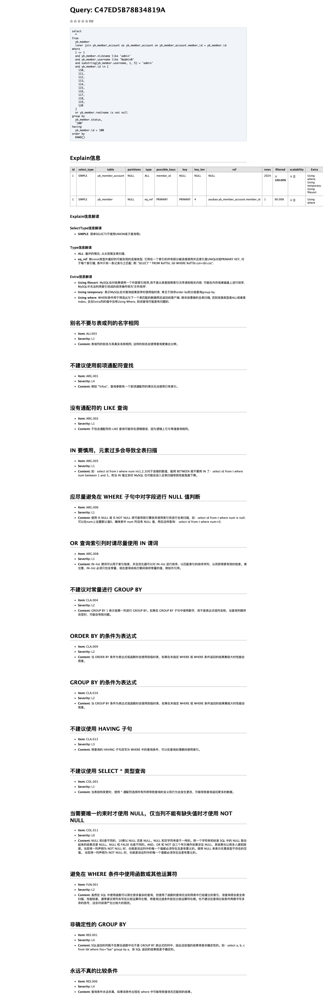

# laravel-soar

> An extension package for optimizing sql statements easily and easily in laravel applications. - 在 Laravel 应用程序中轻松容易的优化 sql 语句的扩展包。

[简体中文](README.md) | [ENGLISH](README-EN.md)

[](https://github.com/guanguans/laravel-soar/actions)
[](https://github.com/guanguans/laravel-soar/actions)
[](https://codecov.io/gh/guanguans/laravel-soar)
[](//packagist.org/packages/guanguans/laravel-soar)
[](//packagist.org/packages/guanguans/laravel-soar)
[](//packagist.org/packages/guanguans/laravel-soar)

## 功能

* 支持基于启发式算法的语句优化
* 支持复杂查询的多列索引优化（UPDATE, INSERT, DELETE, SELECT）
* 支持 EXPLAIN 信息丰富解读
* 支持 SQL 指纹、压缩和美化
* 支持同一张表多条 ALTER 请求合并
* 支持自定义规则的 SQL 改写
* 支持 Eloquent 查询构建器方法生成 SQL 优化报告

## 相关项目

* [https://github.com/XiaoMi/soar](https://github.com/XiaoMi/soar)
* [https://github.com/guanguans/soar-php](https://github.com/guanguans/soar-php)
* [https://github.com/huangdijia/laravel-web-soar](https://github.com/huangdijia/laravel-web-soar)
* [https://github.com/wilbur-yu/hyperf-soar](https://github.com/wilbur-yu/hyperf-soar)
* [https://github.com/guanguans/think-soar](https://github.com/guanguans/think-soar)

## 环境要求

* laravel >= 5.5

## 安装

``` shell
$ composer require guanguans/laravel-soar --dev -vvv
```

### 发布服务

```php
$ php artisan vendor:publish --provider="Guanguans\\LaravelSoar\\SoarServiceProvider"
```

## 使用

### 生成 sql 评分报告示例

``` php
use App\Models\Member;
    
Member::query()
    ->select([
        'id',
        'nickname',
    ])
    ->where('id', 100)
    // ->toSoarScore()
    // ->dumpSoarScore()
    ->ddSoarScore()
;
```


``` php
// 查询构建器使用示例
DB::table('yb_member')
    ->select('*')
    ->join('yb_member_account as yb_member_account', 'yb_member_account.member_id', '=', 'yb_member.id')
    ->whereRaw('1 <> 1')
    ->where('yb_member.nickname', 'like', 'admin')
    ->where('yb_member.username', 'like', '%admin%')
    ->whereRaw("substring(yb_member.username, 1, 5) = 'admin'")
    ->whereIn('yb_member.id', [110, 111, 112, 113, 114, 115, 116, 117, 118, 119, 120])
    ->orWhereNotNull('yb_member.realname')
    ->groupByRaw("yb_member.status, '100'")
    ->having('yb_member.id', '>', '100')
    ->orderByRaw('RAND()')
    // ->toSoarScore()   // 生成 sql 评分报告
    // ->dumpSoarScore() // 打印 sql 评分报告
    ->ddSoarScore()      // 打印 sql 评分报告，并且退出应用程序。
;
```



### 生成 explain 信息解读报告示例

``` php
// 查询构建器使用示例
DB::table('yb_member')
    ->select('*')
    ->join('yb_member_account as yb_member_account', 'yb_member_account.member_id', '=', 'yb_member.id')
    ->whereRaw('1 <> 1')
    ->where('yb_member.nickname', 'like', 'admin')
    ->where('yb_member.username', 'like', '%admin%')
    ->whereRaw("substring(yb_member.username, 1, 5) = 'admin'")
    ->whereIn('yb_member.id', [110, 120])
    ->orWhereNotNull('yb_member.realname')
    ->groupByRaw("yb_member.status, '100'")
    ->having('yb_member.id', '>', '100')
    ->orderByRaw('RAND()')
    // ->toSoarHtmlExplain()   // 生成 explain 信息解读报告
    // ->dumpSoarHtmlExplain() // 打印 explain 信息解读报告
    ->ddSoarHtmlExplain()      // 打印 explain 信息解读报告，并且退出应用程序。
;
```


### 美化 sql 语句

``` php
// 查询构建器使用示例
DB::table('yb_member')
    ->select('*')
    ->join('yb_member_account as yb_member_account', 'yb_member_account.member_id', '=', 'yb_member.id')
    ->whereRaw('1 <> 1')
    ->where('yb_member.nickname', 'like', 'admin')
    ->where('yb_member.username', 'like', '%admin%')
    ->whereRaw("substring(yb_member.username, 1, 5) = 'admin'")
    ->whereIn('yb_member.id', [110, 120])
    ->orWhereNotNull('yb_member.realname')
    ->groupByRaw("yb_member.status, '100'")
    ->having('yb_member.id', '>', '100')
    ->orderByRaw('RAND()')
    // ->toSoarPretty()   // 生成美化后的 sql
    // ->dumpSoarPretty() // 打印美化后的 sql
    ->dumpSoarPretty()    // 打印美化后的 sql，并且退出应用程序。
;
```


### 其他使用示例

``` php
\Soar::score($sql);        // 生成 sql 评分报告
\Soar::mdExplain($sql);    // 生成 markdown 格式的 explain 信息解读报告
\Soar::htmlExplain($sql);  // 生成 html 格式的 Explain 信息解读报告
\Soar::syntaxCheck($sql);  // sql 语法检查
\Soar::fingerPrint($sql);  // 生成 sql 指纹
\Soar::pretty($sql);       // 美化 sql
\Soar::md2html($sql);      // 将 markdown 格式内容转化为 html 格式内容
\Soar::help($sql);         // 输出 soar 帮助命令内容
\Soar::exec($command);     // 执行任意 soar 命令
```

## 测试

``` bash
$ composer test
```

## 变更日志

请参阅 [CHANGELOG](CHANGELOG.md) 获取最近有关更改的更多信息。

## 贡献指南

请参阅 [CONTRIBUTING](.github/CONTRIBUTING.md) 有关详细信息。

## 安全漏洞

请查看[我们的安全政策](../../security/policy)了解如何报告安全漏洞。

## 贡献者

* [guanguans](https://github.com/guanguans)
* [所有贡献者](../../contributors)

## 协议

MIT 许可证（MIT）。有关更多信息，请参见[协议文件](LICENSE)。