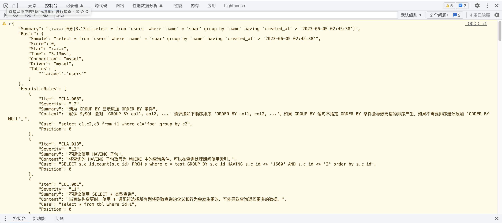

# laravel-soar

> SQL optimizer and rewriter for laravel. - laravel 的 SQL 优化器和重写器。

[简体中文](README.md) | [ENGLISH](README-EN.md)

[](https://github.com/guanguans/laravel-soar/actions)
[](https://github.com/guanguans/laravel-soar/actions)
[](https://codecov.io/gh/guanguans/laravel-soar)
[](//packagist.org/packages/guanguans/laravel-soar)
[](//packagist.org/packages/guanguans/laravel-soar)
[](//packagist.org/packages/guanguans/laravel-soar)

## 功能

* 支持启发式算法语句优化建议、索引优化建议
* 支持 EXPLAIN 信息丰富解读
* 自动监控输出 SQL 优化建议
* Debug bar、Soar bar、JSON、Clockwork、Console、Dump、Log、自定义输出器(多种场景输出)
* 支持查询构建器生成 SQL 优化建议

## 相关项目

* [https://github.com/XiaoMi/soar](https://github.com/XiaoMi/soar)
* [https://github.com/guanguans/soar-php](https://github.com/guanguans/soar-php)
* [https://github.com/huangdijia/laravel-web-soar](https://github.com/huangdijia/laravel-web-soar)
* [https://github.com/wilbur-yu/hyperf-soar](https://github.com/wilbur-yu/hyperf-soar)
* [https://github.com/guanguans/think-soar](https://github.com/guanguans/think-soar)
* [https://github.com/Tinywan/webman-soar](https://github.com/Tinywan/webman-soar)

## 环境要求

* PHP >= 7.4
* ext-json
* ext-pdo

## 安装

```shell
$ composer require guanguans/laravel-soar --dev -vvv
```

## 配置

### 注册服务

#### laravel

```bash
$ php artisan vendor:publish --provider="Guanguans\\LaravelSoar\\SoarServiceProvider"
```

#### lumen

将以下代码段添加到 `bootstrap/app.php` 文件中的 `Register Service Providers` 部分下：

```php
$app->register(\Guanguans\LaravelSoar\SoarServiceProvider::class);
```

## 使用

### 示例代码

<details>
<summary><b>详情</b></summary>

```php
<?php

namespace App\Admin\Controllers;

use App\Http\Controllers\Controller;
use App\User;
use Illuminate\Support\Facades\DB;
use Illuminate\Support\Str;

class SoarController extends Controller
{
    public function sqlScore()
    {
        // 创建表
        DB::select(
            <<<SQL
CREATE TABLE `users` (
  `id` bigint unsigned NOT NULL AUTO_INCREMENT,
  `name` varchar(255) COLLATE utf8mb4_unicode_ci NOT NULL,
  `email` varchar(255) COLLATE utf8mb4_unicode_ci NOT NULL,
  `email_verified_at` timestamp NULL DEFAULT NULL,
  `password` varchar(255) COLLATE utf8mb4_unicode_ci NOT NULL,
  `remember_token` varchar(100) COLLATE utf8mb4_unicode_ci DEFAULT NULL,
  `created_at` timestamp NULL DEFAULT NULL,
  `updated_at` timestamp NULL DEFAULT NULL,
  PRIMARY KEY (`id`),
  UNIQUE KEY `users_email_unique` (`email`)
) ENGINE=InnoDB DEFAULT CHARSET=utf8mb4 COLLATE=utf8mb4_unicode_ci;
SQL
        );

        // 插入数据
        User::query()->insert([
            'name'              => 'soar',
            'email'             => 'soar@soar.com',
            'email_verified_at' => now(),
            'password'          => '$2y$10$92IXUNpkjO0rOQ5byMi.Ye4oKoEa3Ro9llC/.og/at2.uheWG/igi',
            'remember_token'    => Str::random(10),
        ]);

        // 更新数据
        User::query()->update([
            'name'     => 'name',
            'password' => 'password',
        ]);

        // 查询数据
        User::query()->where('name', 'soar')->groupBy('name')->having('created_at', '>', now())->get();

        // 删除数据
        User::query()->where('name', 'soar')->delete();

        // 删除表
        DB::select('DROP table `users`;');

        // return response()->json(['message' => 'ok']); // JSON 响应
        return response('ok'); // HTML 响应
    }
}
```
</details>

### 自动监控输出 SQL 优化建议

<details>
<summary><b>Json 响应</b></summary> 

```json
{
    "message": "ok",
    "soar_scores": [
        {
            "Summary": "[☆☆☆☆☆|0分|3.56ms|select * from `users` where `name` = 'soar' group by `name` having `created_at` > '2022-04-19 18:24:33']",
            "HeuristicRules": [
                {
                    "Item": "CLA.008",
                    "Severity": "L2",
                    "Summary": "请为 GROUP BY 显示添加 ORDER BY 条件",
                    "Content": "默认 MySQL 会对 'GROUP BY col1, col2, ...' 请求按如下顺序排序 'ORDER BY col1, col2, ...'。如果 GROUP BY 语句不指定 ORDER BY 条件会导致无谓的排序产生，如果不需要排序建议添加 'ORDER BY NULL'。",
                    "Case": "select c1,c2,c3 from t1 where c1='foo' group by c2",
                    "Position": 0
                },
                {
                    "Item": "CLA.013",
                    "Severity": "L3",
                    "Summary": "不建议使用 HAVING 子句",
                    "Content": "将查询的 HAVING 子句改写为 WHERE 中的查询条件，可以在查询处理期间使用索引。",
                    "Case": "SELECT s.c_id,count(s.c_id) FROM s where c = test GROUP BY s.c_id HAVING s.c_id <> '1660' AND s.c_id <> '2' order by s.c_id",
                    "Position": 0
                },
                {
                    "Item": "COL.001",
                    "Severity": "L1",
                    "Summary": "不建议使用 SELECT * 类型查询",
                    "Content": "当表结构变更时，使用 * 通配符选择所有列将导致查询的含义和行为会发生更改，可能导致查询返回更多的数据。",
                    "Case": "select * from tbl where id=1",
                    "Position": 0
                },
                {
                    "Item": "ERR.002",
                    "Severity": "L8",
                    "Summary": "MySQL execute failed",
                    "Content": "Expression #1 of SELECT list is not in GROUP BY clause and contains nonaggregated column 'optimizer_220419182434_gwyshx8la4boulhu.users.id' which is not functionally dependent on columns in GROUP BY clause; this is incompatible with sql_mode=only_full_group_by",
                    "Case": "",
                    "Position": 0
                },
                {
                    "Item": "GRP.001",
                    "Severity": "L2",
                    "Summary": "不建议对等值查询列使用 GROUP BY",
                    "Content": "GROUP BY 中的列在前面的 WHERE 条件中使用了等值查询，对这样的列进行 GROUP BY 意义不大。",
                    "Case": "select film_id, title from film where release_year='2006' group by release_year",
                    "Position": 0
                },
                {
                    "Item": "RES.001",
                    "Severity": "L4",
                    "Summary": "非确定性的 GROUP BY",
                    "Content": "SQL返回的列既不在聚合函数中也不是 GROUP BY 表达式的列中，因此这些值的结果将是非确定性的。如：select a, b, c from tbl where foo=\"bar\" group by a，该 SQL 返回的结果就是不确定的。",
                    "Case": "select c1,c2,c3 from t1 where c2='foo' group by c2",
                    "Position": 0
                }
            ],
            "IndexRules": [
                {
                    "Item": "IDX.001",
                    "Severity": "L2",
                    "Summary": "为laravel库的users表添加索引",
                    "Content": "为列name添加索引;为列created_at添加索引; 由于未开启数据采样，各列在索引中的顺序需要自行调整。",
                    "Case": "ALTER TABLE `laravel`.`users` add index `idx_name_created_at` (`name`(191),`created_at`) ;\n",
                    "Position": 0
                }
            ],
            "Explain": [],
            "Backtraces": [
                "#13 /app/Admin/Controllers/HomeController.php:74",
                "#55 /Users/yaozm/Documents/develop/laravel-soar/src/Http/Middleware/OutputSoarScoreMiddleware.php:45",
                "#76 /public/index.php:55",
                "#77 /server.php:21"
            ]
        },
        {
            "Summary": "[★★★★☆|75分|64.5ms|CREATE TABLE `users` (\n  `id` bigint unsigned NOT NULL AUTO_INCREMENT,\n  `name` varchar(255) COLLATE utf8mb4_unicode_ci NOT NULL,\n  `email` varchar(255) COLLATE utf8mb4_unicode_ci NOT NULL,\n  `email_verified_at` timestamp NULL DEFAULT NULL,\n  `password` varchar(255) COLLATE utf8mb4_unicode_ci NOT NULL,\n  `remember_token` varchar(100) COLLATE utf8mb4_unicode_ci DEFAULT NULL,\n  `created_at` timestamp NULL DEFAULT NULL,\n  `updated_at` timestamp NULL DEFAULT NULL,\n  PRIMARY KEY (`id`),\n  UNIQUE KEY `users_email_unique` (`email`)\n) ENGINE=InnoDB DEFAULT CHARSET=utf8mb4 COLLATE=utf8mb4_unicode_ci;]",
            "HeuristicRules": [
                {
                    "Item": "CLA.011",
                    "Severity": "L1",
                    "Summary": "建议为表添加注释",
                    "Content": "为表添加注释能够使得表的意义更明确，从而为日后的维护带来极大的便利。",
                    "Case": "CREATE TABLE `test1` (`ID` bigint(20) NOT NULL AUTO_INCREMENT,`c1` varchar(128) DEFAULT NULL,PRIMARY KEY (`ID`)) ENGINE=InnoDB DEFAULT CHARSET=utf8",
                    "Position": 0
                },
                {
                    "Item": "COL.004",
                    "Severity": "L1",
                    "Summary": "请为列添加默认值",
                    "Content": "请为列添加默认值，如果是 ALTER 操作，请不要忘记将原字段的默认值写上。字段无默认值，当表较大时无法在线变更表结构。",
                    "Case": "CREATE TABLE tbl (col int) ENGINE=InnoDB;",
                    "Position": 0
                },
                {
                    "Item": "COL.005",
                    "Severity": "L1",
                    "Summary": "列未添加注释",
                    "Content": "建议对表中每个列添加注释，来明确每个列在表中的含义及作用。",
                    "Case": "CREATE TABLE tbl (col int) ENGINE=InnoDB;",
                    "Position": 0
                },
                {
                    "Item": "COL.011",
                    "Severity": "L0",
                    "Summary": "当需要唯一约束时才使用 NULL，仅当列不能有缺失值时才使用 NOT NULL",
                    "Content": "NULL 和0是不同的，10乘以 NULL 还是 NULL。NULL 和空字符串是不一样的。将一个字符串和标准 SQL 中的 NULL 联合起来的结果还是 NULL。NULL 和 FALSE 也是不同的。AND、OR 和 NOT 这三个布尔操作如果涉及 NULL，其结果也让很多人感到困惑。当您将一列声明为 NOT NULL 时，也就是说这列中的每一个值都必须存在且是有意义的。使用 NULL 来表示任意类型不存在的空值。 当您将一列声明为 NOT NULL 时，也就是说这列中的每一个值都必须存在且是有意义的。",
                    "Case": "select c1,c2,c3 from tbl where c4 is null or c4 <> 1",
                    "Position": 49
                },
                {
                    "Item": "KWR.003",
                    "Severity": "L1",
                    "Summary": "不建议使用复数做列名或表名",
                    "Content": "表名应该仅仅表示表里面的实体内容，不应该表示实体数量，对应于 DO 类名也是单数形式，符合表达习惯。",
                    "Case": "CREATE TABLE tbl ( `books` int )",
                    "Position": 0
                },
                {
                    "Item": "SEC.002",
                    "Severity": "L0",
                    "Summary": "不使用明文存储密码",
                    "Content": "使用明文存储密码或者使用明文在网络上传递密码都是不安全的。如果攻击者能够截获您用来插入密码的SQL语句，他们就能直接读到密码。另外，将用户输入的字符串以明文的形式插入到纯SQL语句中，也会让攻击者发现它。如果您能够读取密码，黑客也可以。解决方案是使用单向哈希函数对原始密码进行加密编码。哈希是指将输入字符串转化成另一个新的、不可识别的字符串的函数。对密码加密表达式加点随机串来防御“字典攻击”。不要将明文密码输入到SQL查询语句中。在应用程序代码中计算哈希串，只在SQL查询中使用哈希串。",
                    "Case": "create table test(id int,name varchar(20) not null,password varchar(200)not null)",
                    "Position": 0
                },
                {
                    "Item": "STA.003",
                    "Severity": "L1",
                    "Summary": "索引起名不规范",
                    "Content": "建议普通二级索引以idx_为前缀，唯一索引以uk_为前缀。",
                    "Case": "select col from now where type!=0",
                    "Position": 0
                }
            ],
            "IndexRules": [],
            "Explain": [],
            "Backtraces": [
                "#9 /app/Admin/Controllers/HomeController.php:46",
                "#51 /Users/yaozm/Documents/develop/laravel-soar/src/Http/Middleware/OutputSoarScoreMiddleware.php:45",
                "#72 /public/index.php:55",
                "#73 /server.php:21"
            ]
        },
        {
            "Summary": "[★★★★☆|80分|21.9ms|update `users` set `name` = 'name', `password` = 'password', `users`.`updated_at` = '2022-04-19 18:24:33']",
            "HeuristicRules": [
                {
                    "Item": "CLA.015",
                    "Severity": "L4",
                    "Summary": "UPDATE 未指定 WHERE 条件",
                    "Content": "UPDATE 不指定 WHERE 条件一般是致命的，请您三思后行",
                    "Case": "update tbl set col=1",
                    "Position": 0
                }
            ],
            "IndexRules": [],
            "Explain": {
                "Item": "EXP.000",
                "Severity": "L0",
                "Summary": "Explain信息",
                "Content": [
                    "| id | select\\_type | table | partitions | type | possible_keys | key | key\\_len | ref | rows | filtered | scalability | Extra |",
                    "|---|---|---|---|---|---|---|---|---|---|---|---|---|",
                    "| 1  | UPDATE | *users* | NULL | index | NULL | PRIMARY | 8 | NULL | 1 | ☠️ **100.00%** | O(n) | NULL |",
                    "",
                    ""
                ],
                "Case": [
                    "### Explain信息解读",
                    "",
                    "#### Type信息解读",
                    "",
                    "* **index**: 全表扫描, 只是扫描表的时候按照索引次序进行而不是行. 主要优点就是避免了排序, 但是开销仍然非常大.",
                    ""
                ],
                "Position": 0
            },
            "Backtraces": [
                "#10 /app/Admin/Controllers/HomeController.php:70",
                "#52 /Users/yaozm/Documents/develop/laravel-soar/src/Http/Middleware/OutputSoarScoreMiddleware.php:45",
                "#73 /public/index.php:55",
                "#74 /server.php:21"
            ]
        },
        {
            "Summary": "[★★★★★|90分|4.5ms|delete from `users` where `name` = 'soar']",
            "HeuristicRules": [
                {
                    "Item": "SEC.003",
                    "Severity": "L0",
                    "Summary": "使用DELETE/DROP/TRUNCATE等操作时注意备份",
                    "Content": "在执行高危操作之前对数据进行备份是十分有必要的。",
                    "Case": "delete from table where col = 'condition'",
                    "Position": 0
                }
            ],
            "IndexRules": [
                {
                    "Item": "IDX.001",
                    "Severity": "L2",
                    "Summary": "为laravel库的users表添加索引",
                    "Content": "为列name添加索引; 由于未开启数据采样，各列在索引中的顺序需要自行调整。",
                    "Case": "ALTER TABLE `laravel`.`users` add index `idx_name` (`name`(191)) ;\n",
                    "Position": 0
                }
            ],
            "Explain": {
                "Item": "EXP.000",
                "Severity": "L0",
                "Summary": "Explain信息",
                "Content": [
                    "| id | select\\_type | table | partitions | type | possible_keys | key | key\\_len | ref | rows | filtered | scalability | Extra |",
                    "|---|---|---|---|---|---|---|---|---|---|---|---|---|",
                    "| 1  | DELETE | *users* | NULL | ALL | NULL | NULL | NULL | NULL | 1 | ☠️ **100.00%** | O(n) | Using where |",
                    "",
                    ""
                ],
                "Case": [
                    "### Explain信息解读",
                    "",
                    "#### Type信息解读",
                    "",
                    "* **ALL**: 最坏的情况, 从头到尾全表扫描.",
                    "",
                    "#### Extra信息解读",
                    "",
                    "* **Using where**: WHERE条件用于筛选出与下一个表匹配的数据然后返回给客户端. 除非故意做的全表扫描, 否则连接类型是ALL或者是index, 且在Extra列的值中没有Using Where, 则该查询可能是有问题的.",
                    ""
                ],
                "Position": 0
            },
            "Backtraces": [
                "#10 /app/Admin/Controllers/HomeController.php:76",
                "#52 /Users/yaozm/Documents/develop/laravel-soar/src/Http/Middleware/OutputSoarScoreMiddleware.php:45",
                "#73 /public/index.php:55",
                "#74 /server.php:21"
            ]
        },
        {
            "Summary": "[★★★★★|100分|15.57ms|insert into `users` (`name`, `email`, `email_verified_at`, `password`, `remember_token`) values ('soar', 'soar@soar.com', '2022-04-19 18:24:33', '$2y$10$92IXUNpkjO0rOQ5byMi.Ye4oKoEa3Ro9llC/.og/at2.uheWG/igi', 'HecXUdevky')]",
            "HeuristicRules": [],
            "IndexRules": [],
            "Explain": {
                "Item": "EXP.000",
                "Severity": "L0",
                "Summary": "Explain信息",
                "Content": [
                    "| id | select\\_type | table | partitions | type | possible_keys | key | key\\_len | ref | rows | filtered | scalability | Extra |",
                    "|---|---|---|---|---|---|---|---|---|---|---|---|---|",
                    "| 1  | INSERT | *users* | NULL | ALL | NULL | NULL | NULL | NULL | 0 | 0.00% | O(n) | NULL |",
                    "",
                    ""
                ],
                "Case": [
                    "### Explain信息解读",
                    "",
                    "#### Type信息解读",
                    "",
                    "* **ALL**: 最坏的情况, 从头到尾全表扫描.",
                    ""
                ],
                "Position": 0
            },
            "Backtraces": [
                "#10 /app/Admin/Controllers/HomeController.php:66",
                "#52 /Users/yaozm/Documents/develop/laravel-soar/src/Http/Middleware/OutputSoarScoreMiddleware.php:45",
                "#73 /public/index.php:55",
                "#74 /server.php:21"
            ]
        }
    ]
}
```
</details>

<details>
<summary><b>Soar bar</b></summary>

    
</details>

<details>
<summary><b>Debug bar</b></summary>


</details>

<details>
<summary><b>Clockwork</b></summary>


</details>

<details>
<summary><b>Console</b></summary>


</details>

<details>
<summary><b>Dump</b></summary>


</details>

<details>
<summary><b>Log</b></summary>


</details>

<details>
<summary><b>自定义输出器</b></summary>

1. 实现该接口

```php
<?php

namespace Guanguans\LaravelSoar\Contracts;

use Illuminate\Support\Collection;

interface Output
{
    public function output(Collection $scores, $dispatcher);
}
```

2. `config/soar.php` 中配置输出器即可

```php
<?php

return [
	...
    'output' => [
        // \Guanguans\LaravelSoar\Outputs\ClockworkOutput::class,
        // \Guanguans\LaravelSoar\Outputs\ConsoleOutput::class,
        // \Guanguans\LaravelSoar\Outputs\DumpOutput::class => ['exit' => false],
        \Guanguans\LaravelSoar\Outputs\JsonOutput::class,
        \Guanguans\LaravelSoar\Outputs\LogOutput::class => ['channel' => 'daily'],
        \Guanguans\LaravelSoar\Outputs\DebugBarOutput::class,
        \Guanguans\LaravelSoar\Outputs\SoarBarOutput::class,
    ],
	...
];
```
</details>

### Soar 实例及方法

<details>
<summary><b>详情</b></summary>

```php
app('soar'); // 获取 Soar 实例

/**
 * Soar 门面.
 * 
 * @method static \self create(array $options = [], null|string $soarPath = null)
 * @method static string help()
 * @method static string version()
 * @method static \self clone()
 * @method static array arrayScores(array|string $sqls, int $depth = 512, int $options = 0)
 * @method static string jsonScores(array|string $sqls)
 * @method static string htmlScores(array|string $sqls)
 * @method static string markdownScores(array|string $sqls)
 * @method static string scores(array|string $sqls)
 * @method static \self addOptions(array $options)
 * @method static \self addOption(string $key, void $value)
 * @method static \self removeOptions(array $keys)
 * @method static \self removeOption(string $key)
 * @method static \self onlyOptions(array $keys = ['-test-dsn','-online-dsn'])
 * @method static \self onlyOption(string $key)
 * @method static \self setOptions(array $options)
 * @method static \self setOption(string $key, void $value)
 * @method static \self mergeOptions(array $options)
 * @method static \self mergeOption(string $key, void $value)
 * @method static array getOptions()
 * @method static void getOption(string $key, void $default = null)
 * @method static string getSerializedNormalizedOptions()
 * @method static array getNormalizedOptions()
 * @method static string getSoarPath()
 * @method static \self setSoarPath(string $soarPath)
 * @method static void dd(void ...$args)
 * @method static \self dump(void ...$args)
 * @method static string run(array|string $withOptions = [], null|callable $processTapper = null, null|callable $callback = null)
 * @method static \Guanguans\LaravelSoar\Soar|\Illuminate\Support\HigherOrderTapProxy tap(null|callable $callback = null)
 *
 * @see \Guanguans\LaravelSoar\Soar
 */
class Soar{}
```
</details>

### 查询构建器方法

<details>
<summary><b>详情</b></summary>

```php
namespace Illuminate\Database\Eloquent {
    /**
     * @method string toRawSql()
     * @method void dumpRawSql()
     * @method void ddRawSql()
     * @method array toSoarArrayScores()
     * @method void dumpSoarArrayScores()
     * @method void ddSoarArrayScores()
     * @method string toSoarJsonScores()
     * @method void dumpSoarJsonScores()
     * @method void ddSoarJsonScores()
     * @method string toSoarHtmlScores()
     * @method void echoSoarHtmlScores()
     * @method void exitSoarHtmlScores()
     *
     * @mixin \Illuminate\Database\Query\Builder
     *
     * @see \Guanguans\LaravelSoar\Macros\QueryBuilderMacro
     * @see \Illuminate\Database\Eloquent\Builder
     */
    class Builder
    {
    }
}
```
</details>

## 测试

```bash
$ composer test
```

## 变更日志

请参阅 [CHANGELOG](CHANGELOG.md) 获取最近有关更改的更多信息。

## 贡献指南

请参阅 [CONTRIBUTING](.github/CONTRIBUTING.md) 有关详细信息。

## 安全漏洞

请查看[我们的安全政策](../../security/policy)了解如何报告安全漏洞。

## 贡献者

* [guanguans](https://github.com/guanguans)
* [所有贡献者](../../contributors)

## 协议

MIT 许可证（MIT）。有关更多信息，请参见[协议文件](LICENSE)。
