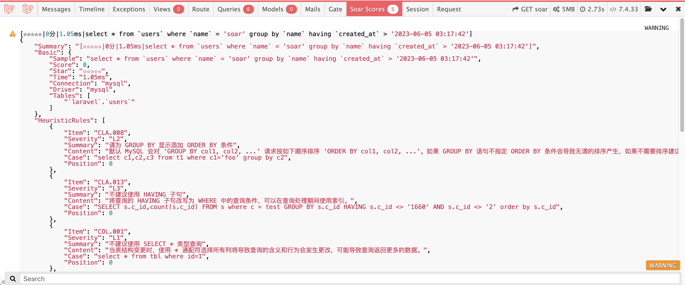

# laravel-soar



> Sql optimizer、rewriter for laravel. - sql 优化器、重写器。

[简体中文](README.md) | [ENGLISH](README-EN.md)

[](https://github.com/guanguans/laravel-soar/actions)
[](https://github.com/guanguans/laravel-soar/actions)
[](https://codecov.io/gh/guanguans/laravel-soar)
[](//packagist.org/packages/guanguans/laravel-soar)
[](//packagist.org/packages/guanguans/laravel-soar)
[](//packagist.org/packages/guanguans/laravel-soar)

## 功能

* 支持基于启发式算法的语句优化
* 支持复杂查询的多列索引优化（UPDATE, INSERT, DELETE, SELECT）
* 支持 EXPLAIN 信息丰富解读
* 支持 SQL 指纹、压缩和美化
* 支持同一张表多条 ALTER 请求合并
* 支持自定义规则的 SQL 改写
* 支持 Eloquent 查询构建器方法生成 SQL 优化报告

## 相关项目

* [https://github.com/XiaoMi/soar](https://github.com/XiaoMi/soar)
* [https://github.com/guanguans/soar-php](https://github.com/guanguans/soar-php)
* [https://github.com/huangdijia/laravel-web-soar](https://github.com/huangdijia/laravel-web-soar)
* [https://github.com/wilbur-yu/hyperf-soar](https://github.com/wilbur-yu/hyperf-soar)
* [https://github.com/guanguans/think-soar](https://github.com/guanguans/think-soar)

## 环境要求

* laravel >= 6.10

## 安装

```shell
$ composer require guanguans/laravel-soar --dev -vvv
```

## 配置

### 注册服务

#### laravel

```bash
$ php artisan vendor:publish --provider="Guanguans\\LaravelSoar\\SoarServiceProvider"
```

#### lumen

将以下代码段添加到 `bootstrap/app.php` 文件中的 `Register Service Providers` 部分下：

```php
$app->register(\Guanguans\LaravelSoar\SoarServiceProvider::class);
```

## 使用

### 自动监控输出 sql 评分


### 使用示例

```php
$soar = app('soar'); // 获取 soar 实例
User::query()->ddSoarJsonScore() // 便捷查询器方法输出评分报告
\Soar::jsonScore(User::query()->toRawSql()); // soar 门面生成评分报告
```

## 测试

```bash
$ composer test
```

## 变更日志

请参阅 [CHANGELOG](CHANGELOG.md) 获取最近有关更改的更多信息。

## 贡献指南

请参阅 [CONTRIBUTING](.github/CONTRIBUTING.md) 有关详细信息。

## 安全漏洞

请查看[我们的安全政策](../../security/policy)了解如何报告安全漏洞。

## 贡献者

* [guanguans](https://github.com/guanguans)
* [所有贡献者](../../contributors)

## 协议

MIT 许可证（MIT）。有关更多信息，请参见[协议文件](LICENSE)。
